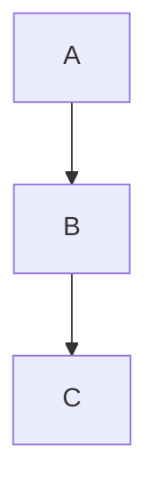

# MarkRender — Project Analysis & Feature Report

> **Scope**: Analysis of `prd.md`, `techstack.md`, `design.md`, `phase_plan.md` + evaluation of proposed features and new suggestions.
> **Date**: 2026-03-03

---

## 1. Overall Assessment

The project is well-conceived and tightly scoped. The docs are internally consistent — the PRD, tech stack, and design system all agree on direction. The core promise (`"What I preview is exactly what I export."`) is an achievable, testable guarantee that anchors every decision well.

### What the Plan Gets Right

| Strength | Why It Matters |
|----------|----------------|
| Single rendering pipeline | Preview ↔ PDF fidelity is guaranteed by design, not by luck |
| `window.print()` for PDF | Zero dependency, browser-native, impossible to mismatch |
| Calm Night design system | Defined upfront with tokens — no ad-hoc styling decisions later |
| Git checkpoints per phase | Rollback safety at every step |
| Verify-then-pause rule | Prevents compounding bugs mid-build |
| Modular folder structure | `markdown/` separated from `components/` — reusable pipeline from day one |

### Gaps & Risks in the Current Plan

> [!WARNING]
> **Phase 2 has a hidden dependency**: Google Fonts are loaded via CDN (`fonts.googleapis.com`). But the PRD says the app should work offline. For a web app deployed to Vercel this is fine for MVP, but it's worth noting early: if offline is a hard requirement, fonts must be self-hosted.

> [!WARNING]
> **`window.print()` is a system dialog**: The user must manually click "Save as PDF" in the OS print dialog. There is no JS API to auto-name the file or skip the dialog. This means features like "custom PDF title" and "page size selection" have limited control — only what the browser exposes.

> [!NOTE]
> **Plain textarea (Phase 4)**: The tech doc accepts this for MVP, but a textarea has no syntax highlighting, no line numbers, and no Markdown shortcuts (bold with `**`, etc.). This is the biggest UX gap in v0.1. CodeMirror or a lightweight alternative in Phase 4 would elevate the editing experience significantly.

> [!NOTE]
> **No loading state for Prism/KaTeX**: Both libraries have async or heavy init paths. If not initialized before first render, the first preview flash may show raw text. A simple "initializing…" guard state should be planned.

> [!NOTE]
> **No error boundary**: If `renderMarkdown()` throws unexpectedly (e.g., a Prism plugin error), the entire React tree crashes with a white screen. A simple `<ErrorBoundary>` in Phase 5 would contain this.

---

## 2. Your Proposed Features — Full Evaluation

Each feature is rated on **Effort** (dev time), **Impact** (user value), and **Fit** (alignment with existing docs).

---

### 2.1 Word Count & Reading Time ✅ MVP-Ready

**Effort**: Low (30 min) | **Impact**: High | **Fit**: Perfect

A natural fit for a writing and study tool. Easily derived from the existing markdown string:

```js
const words = markdown.trim().split(/\s+/).filter(Boolean).length;
const readingTime = Math.ceil(words / 200); // 200 wpm average
```

Display in the toolbar as `1,243 words · ~6 min read`. Adds immediate value with zero architectural cost.

> **Verdict: Add to Phase 7 (Toolbar). ~30 min.**

---

### 2.2 Scroll Sync ✅ MVP-Ready (Stretch)

**Effort**: Medium (1–1.5 hrs) | **Impact**: High | **Fit**: Good

When the user scrolls the editor, the preview scrolls proportionally (and vice versa). This is the feature that separates "good enough" from "great" for a split-view tool.

**Approach**:
- Track `scrollTop / scrollHeight` ratio of the source panel
- Apply the same ratio to the target panel's scroll position
- Use a debounced scroll event listener to avoid feedback loops

**Risk**: Mapping editor line numbers to preview DOM positions is non-trivial with a plain `<textarea>`. It becomes much easier with CodeMirror, which exposes line-to-position APIs.

> **Verdict: Add to Phase 8 (Polish). Worth the effort. ~1 hr.**

---

### 2.3 Autosave to localStorage ✅ MVP-Ready

**Effort**: Low (30 min) | **Impact**: High | **Fit**: Perfect

Protects against accidental tab closure. The user never loses work:

```js
// On change (debounced)
localStorage.setItem('markrender_autosave', markdown);

// On load
const saved = localStorage.getItem('markrender_autosave');
if (saved) setMarkdown(saved);
```

Add a subtle "Autosaved" flash indicator in the toolbar when it fires. The PRD says the app exports from the current buffer — autosave reinforces this.

> **Verdict: Add to Phase 7 (App state). ~30 min.**

---

### 2.4 Custom PDF Title & Page Setup ⚠️ Stretch (Limited by Browser)

**Effort**: Medium (1 hr) | **Impact**: Medium | **Fit**: Partial — constrained by `window.print()`

This is the most architecturally constrained idea because `window.print()` hands off to the OS. What IS controllable:

| Feature | Feasible? |
|---------|-----------|
| Set PDF filename hint | ✅ Yes — `document.title = 'MyFile'` before calling `window.print()` (Chrome uses this as the default filename) |
| Page size (A4/Letter/A3) | ✅ Yes — inject `<style>@page { size: A4 }</style>` dynamically before printing |
| Margins | ✅ Yes — same dynamic `@page` injection |
| Header/footer | ⚠️ Partially — browser adds its own; can suppress with `-webkit-print-color-adjust` |
| Skip browser print dialog | ❌ No — unavoidable in a pure web app |

A small "Print Settings" panel (modal or dropdown) with A4/Letter/A3 + margin presets before triggering print is the right approach.

> **Verdict: Scoped version (title + page size + margin presets) can be added in Phase 6. Full UI adds ~1 hr.**

---

### 2.5 Keyboard Shortcuts ✅ MVP-Ready

**Effort**: Low (30 min) | **Impact**: Medium-High | **Fit**: Perfect

Keyboard shortcuts are expected in any serious writing tool:

| Shortcut | Action |
|----------|--------|
| `Ctrl+Shift+E` | Export PDF |
| `Ctrl+Shift+V` | Toggle view mode |
| `Ctrl+S` | Trigger autosave (manual) |
| `Ctrl+/` | Focus editor |
| `Escape` | Close any open modal/panel |

Use `window.addEventListener('keydown', ...)` in `App.jsx`. Clean up on unmount.

> **Verdict: Add to Phase 7. ~30 min.**

---

### 2.6 CodeMirror Syntax Highlighting ✅ Strongly Recommended

**Effort**: Medium (1–1.5 hrs over baseline textarea) | **Impact**: Very High | **Fit**: Excellent

This is the single biggest upgrade over the plain textarea. CodeMirror 6 provides:
- Markdown syntax highlighting (headings, bold, links in color)
- Line numbers
- Current line highlighting
- Better tab handling
- Extensible for future features (autocomplete, vim mode, etc.)

The current tech doc says "textarea for MVP" but this was accepted as a baseline, not a preference. Given that the design doc calls for a premium feel, a plain textarea will feel jarring.

**Package**: `@codemirror/view`, `@codemirror/state`, `@codemirror/lang-markdown`, `@codemirror/theme-one-dark`

> **Verdict: Upgrade Phase 4 to use CodeMirror. Time impact: +1 hr to Phase 4. Strongly worth it.**

---

### 2.7 YAML Frontmatter Support ✅ MVP-Ready

**Effort**: Low (30–45 min) | **Impact**: Medium | **Fit**: Good

YAML frontmatter is a standard feature for Markdown files (used in Hugo, Jekyll, Obsidian, etc.):

```markdown
---
title: My Notes
author: User
date: 2026-03-03
---
# Content starts here
```

**Approach**: Strip the `---...---` block before passing to `renderMarkdown()`, parse the YAML with `js-yaml`, and optionally inject `title` / `author` as a styled header in the preview.

**Bonus**: The parsed title can be used as the PDF filename hint (see §2.4).

> **Verdict: Add to Phase 3 (parser.js). ~30 min using `js-yaml`.**

---

### 2.8 Diagrams (Mermaid.js) ⚠️ Stretch

**Effort**: Medium-High (1.5–2 hrs) | **Impact**: Medium | **Fit**: Good for study/technical notes

Mermaid renders diagrams from code blocks:

````markdown

````

**Risk**: Mermaid.js is a large library (~600KB gzipped). It also renders asynchronously, which can cause the PDF export to fire before diagrams finish rendering. A `mermaid.run()` await before `window.print()` is needed.

**Also**: Mermaid diagrams are SVG — they print cleanly.

> **Verdict: Good feature but adds real complexity. Recommend Post-Phase-9 after MVP is stable. Better suited to v0.2.**

---

### 2.9 Offline (PWA) ✅ MVP-Ready (Post-Build Step)

**Effort**: Low (1 hr, mostly config) | **Impact**: High | **Fit**: Perfect — PRD mentions offline as desirable

A Progressive Web App can be installed and used without internet.

**Tools**: `vite-plugin-pwa` — handles service worker, cache strategy, and manifest automatically.

```bash
npm install vite-plugin-pwa
```

Add to `vite.config.js`:
```js
import { VitePWA } from 'vite-plugin-pwa';
// Register with manifest + offline cache strategy
```

**Caveats**:
- Google Fonts CDN will **not** work offline — must switch to locally bundled fonts
- KaTeX fonts must also be in `public/`

> **Verdict: Add as Phase 9 post-step once build is confirmed working. ~1 hr.**

---

### 2.10 Pagination / Page Break Indicators ⚠️ Stretch

**Effort**: Medium (1–2 hrs) | **Impact**: Medium | **Fit**: Good

Showing visual page break lines in the preview panel ("Page 1 / Page 2...") so the user knows where content will be cut.

**Approach**: Calculate an estimated page height (A4 = ~1122px at 96dpi) and inject a `<div class="page-break-indicator">` every N pixels in the preview DOM.

**Limitation**: This is an approximation. The actual `window.print()` engine may paginate slightly differently. Don't promise exact breaks.

**Alternative simpler version**: Show just a footer like `~3 pages` based on word count.

> **Verdict: Word-count page estimate is trivial (add to toolbar). Visual page lines are v0.2 material.**

---

### 2.11 Variable Fonts / Multiple Font Selections ⚠️ Stretch

**Effort**: Medium (1 hr) | **Impact**: Medium | **Fit**: Aligns with design doc Phase 2 roadmap

A font selector (dropdown in toolbar) that changes a CSS variable:

```js
// Fonts: Inter, Georgia, Merriweather, JetBrains Mono (code-style), etc.
document.documentElement.style.setProperty('--font-body', 'Merriweather');
```

Since fonts must be loaded, each option would add a Google Font import or local font file. The print CSS must also inherit the selected variable so the PDF matches.

> **Verdict: Good v0.2 feature. Adds 1hr+ per font. Leave for after MVP is solid.**

---

## 3. Post-MVP Ideas — Your Suggestions

### 3.1 Drag & Drop Image Insert
**Effort**: Medium | **Impact**: High

`FileReader` API converts dragged-in image files to base64 inline data URIs:
```markdown

```
This works offline too. The print engine renders embedded images cleanly. 

> **Worth building in v0.2 — no backend needed.**

### 3.2 Paste from Clipboard + Turndown (HTML → Markdown)
**Effort**: Medium | **Impact**: High

Detect `paste` events with HTML content (`event.clipboardData.getData('text/html')`), pass to [Turndown](https://github.com/domchristie/turndown) to convert to Markdown, then insert at cursor.

This is a genuinely delightful feature — copy from a webpage, paste into MarkRender, get clean Markdown.

> **Excellent v0.2 feature. Turndown is mature and lightweight.**

### 3.3 Version History
**Effort**: High | **Impact**: Medium

Requires IndexedDB for persistent multi-version storage, a version browser UI, and diff rendering. This is a significant feature.

> **v1.0 territory — not v0.2. Would significantly extend scope.**

---

## 4. My Own Suggestions

These aren't in your current plans but are strong additions given the stack and design goals:

| Suggestion | Why | Effort |
|-----------|-----|--------|
| **Focus / Zen Mode** | Hide toolbar, maximize editor: a single Button or `F11` shortcut. Aligned with "distraction-free" PRD goal. | ~20 min |
| **Copy Rendered HTML button** | Exports the styled HTML string to clipboard. Useful for pasting into CMSs, email, etc. Reuses the existing pipeline at zero cost. | ~30 min |
| **Error Boundary component** | Wraps `<Preview>` so a broken render shows a friendly message instead of crashing the whole app. Safety net for invalid Markdown edge cases. | ~30 min |
| **Estimated page count** | e.g. `~3 pages` shown next to word count. Simple division: `words / 300` ≈ pages. Costs nothing. | ~10 min |
| **Character count toggle** | Users writing to specific limits (essays, reports) want this. Wrap alongside word count. | ~10 min |
| **Markdown cheatsheet panel** | Side drawer or modal with quick reference for Markdown syntax. Great for less technical users. | ~1 hr |
| **Print progress indicator** | A subtle "Generating PDF…" toast that auto-dismisses — `window.print()` blocks the thread briefly. Prevents double-clicking Export. | ~20 min |
| **Local file open (File System Access API)** | Chrome supports `window.showOpenFilePicker()` — lets users open `.md` files from disk without drag/drop. No Electron needed. | ~1 hr |

---

## 5. Recommended Priority Matrix

**For the 7–8 hour MVP:**

```
✅ INCLUDE  →  High impact, low effort, fits existing plan
⚡ STRETCH   →  High impact, medium effort, only if time allows
🔜 POST-MVP →  Valuable but out of scope for day-one build
```

| Feature | Priority | Phase |
|---------|----------|-------|
| Autosave to localStorage | ✅ INCLUDE | 7 |
| Keyboard shortcuts | ✅ INCLUDE | 7 |
| Word count + reading time | ✅ INCLUDE | 7 |
| Error boundary | ✅ INCLUDE | 5 |
| Print progress indicator | ✅ INCLUDE | 6 |
| Estimated page count | ✅ INCLUDE | 7 |
| YAML frontmatter | ✅ INCLUDE | 3 |
| CodeMirror editor upgrade | ✅ INCLUDE | 4 |
| Custom PDF title + page size | ⚡ STRETCH | 6 |
| Focus / Zen mode | ⚡ STRETCH | 8 |
| Scroll sync | ⚡ STRETCH | 8 |
| Copy as HTML | ⚡ STRETCH | 8 |
| PWA / Offline | ⚡ STRETCH | 9 |
| Mermaid diagrams | 🔜 POST-MVP | v0.2 |
| Variable font selector | 🔜 POST-MVP | v0.2 |
| Visual page break indicators | 🔜 POST-MVP | v0.2 |
| Drag & drop images | 🔜 POST-MVP | v0.2 |
| Paste + Turndown | 🔜 POST-MVP | v0.2 |
| Markdown cheatsheet panel | 🔜 POST-MVP | v0.2 |
| File System Access API (open .md) | 🔜 POST-MVP | v0.2 |
| Version history | 🔜 POST-MVP | v1.0 |

---

## 6. Summary Verdict

The plan is solid and the 7–8 hour target is realistic for the current scope. Including the **✅ INCLUDE** features above adds roughly **2–2.5 hours** of work — but most of them are small enough to absorb within the existing phases without blowing the schedule.

The two biggest impact-per-hour upgrades are:
1. **CodeMirror over textarea** — transforms the editor from functional to premium
2. **Autosave + YAML frontmatter** — complete the "zero friction writing" promise of the PRD

The **⚡ STRETCH** features (scroll sync, PWA, focus mode) are good to start on after Phases 1–7 are verified clean, using the buffer in Phase 8–9.

Everything else is clearly v0.2 or later — and the modular architecture already supports all of it without redesign.
