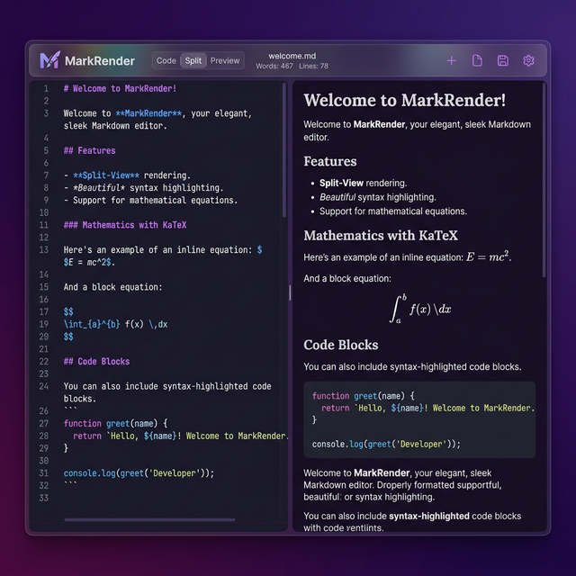

# ✨ MarkRender

> A dark-themed Markdown editor with live preview & PDF export. Built it to learn stuff, ended up actually using it.



---

## 🤔 What is this?

**MarkRender** is a browser-based Markdown editor I built while learning web dev. Split-pane layout — you type Markdown on the left, it renders live on the right. Has a custom dark theme I'm calling "Calm Night" (purple gradients, glassmorphism, the whole vibe), and you can export everything to PDF directly from the browser. No backend, no accounts, nothing. Just open it and write.

---

## 📖 Why does this exist?

So here's the thing — I'm a beginner, and I'm mainly aiming for **Cloud & DevOps** roles. Frontend isn't really my lane. But I kept running into this annoying problem: I take a bunch of technical study notes in Markdown, and then when I want a clean PDF version, the existing tools either look terrible, need an account, or are way too bloated for what I need.

So I figured, why not just build one? It started as a "let me just make a quick thing" and turned into a full 9-phase project with a custom design system and everything lol. Since frontend isn't my main focus, I leaned on AI (vibe coding) for a lot of the React boilerplate and CSS styling — but the planning, architecture, debugging, and "wait why is KaTeX eating my backslashes at 1 AM" moments were all me. More on that in the disclaimer below.

---

## 🚀 Features

- ✍️ **CodeMirror 6 Editor** — Syntax-highlighted Markdown editing with line numbers, bracket matching, and line wrapping
- 👁️ **Live Preview** — Instantly renders your Markdown as you type
- 🧮 **KaTeX Math** — Full LaTeX math support (inline `$...$` and display `$$...$$`)
- 🎨 **Prism.js Syntax Highlighting** — Beautiful code blocks with language detection
- 📄 **PDF Export** — Configurable page size (A4/Letter/A3), margins, and PDF title via `window.print()`
- 📝 **YAML Frontmatter** — Parse `title`, `author`, `date` from frontmatter blocks
- 💾 **Autosave** — Debounced save to `localStorage` — never lose your work
- ⌨️ **Keyboard Shortcuts** — `Ctrl+S` (save), `Ctrl+Shift+V` (toggle view), `Ctrl+Shift+E` (export), and more
- 📊 **Word Count & Stats** — Words, characters, reading time, and estimated pages in the toolbar
- 🔄 **Scroll Sync** — Editor and preview scroll together proportionally
- 🧘 **Focus / Zen Mode** — Hide the toolbar and go distraction-free (`F11` or toolbar button)
- 🛡️ **Error Boundary** — Graceful fallback UI if something goes wrong in the preview
- 🌙 **Calm Night Theme** — A custom dark design system with purple gradients, glassmorphism toolbar, and carefully tuned typography

---

## 🛠️ Tech Stack

| Category          | Technology                                                                             |
| ----------------- | -------------------------------------------------------------------------------------- |
| Framework         | [React 19](https://react.dev/)                                                         |
| Build Tool        | [Vite 7](https://vite.dev/)                                                            |
| Editor            | [CodeMirror 6](https://codemirror.net/)                                                |
| Markdown Parser   | [markdown-it](https://github.com/markdown-it/markdown-it)                              |
| Math Rendering    | [KaTeX](https://katex.org/)                                                            |
| Code Highlighting | [Prism.js](https://prismjs.com/)                                                       |
| YAML Parsing      | [js-yaml](https://github.com/nodeca/js-yaml)                                           |
| Styling           | Vanilla CSS with custom design tokens                                                  |
| Fonts             | [Inter](https://rsms.me/inter/) + [JetBrains Mono](https://www.jetbrains.com/lp/mono/) |

---

## 📚 What I Learned

Honestly didn't expect to learn this much from a "simple" Markdown editor. The frontend stuff was mostly vibe coded (React, CSS, CodeMirror wiring), but the skills below are ones I actually had to work through and understand — and a lot of them carry over to the Cloud/DevOps path I'm on.

### Stuff that's actually relevant

- **Git & Version Control** — Structured the whole project around git checkpoints. Every phase ended with a clean commit, so I could roll back if things broke. Basically treated it like a mini CI pipeline — build phase, verify, commit, move on.
- **Build Tooling & npm** — Setting up Vite from scratch, managing `package.json` dependencies, running dev/build/preview scripts, understanding what the bundler actually does with 159 modules. This is the kind of tooling knowledge that shows up everywhere in DevOps.
- **Project Planning & Phased Execution** — Broke the whole thing into 9 phases with checklists, trackers, and verify-then-stop rules. Very similar to how you'd plan infrastructure rollouts — don't move to the next step until the current one is confirmed working.
- **Debugging & Problem Solving** — Tracking down why `defaultKeymap` was undefined (missing transitive dependency), figuring out scroll sync feedback loops, making sure KaTeX processes math _before_ markdown-it escapes the backslashes. These are the kinds of debugging skills that transfer to any stack.
- **Working with `localStorage` & Browser Storage** — Understanding key-value persistence, debounced writes, and restoring state on page load. Conceptually similar to working with config stores or caches.
- **YAML Parsing** — Used `js-yaml` to parse frontmatter blocks. YAML is everywhere in DevOps (Kubernetes manifests, CI/CD configs, Ansible playbooks), so understanding how it gets parsed programmatically was a nice bonus.
- **Understanding Build Outputs** — Analyzing the production bundle (1.17MB total, 394KB gzipped), knowing what contributes to bundle size, and thinking about optimization. Relates to artifact management and deployment awareness.

### Other stuff I picked up along the way

These are more frontend-specific and were mostly handled with AI assistance, but I still had to understand them enough to debug issues and make decisions:

- **React component lifecycle** — How hooks like `useEffect`, `useRef`, and `useCallback` work together, and why you can't just throw state around randomly without things re-rendering
- **Print CSS & `@page` rules** — How `@media print` works, dynamically injecting page size/margin styles before calling `window.print()`. Kinda niche but was cool to learn
- **Debouncing & event management** — Preventing scroll sync from creating infinite loops, keeping the editor responsive during fast typing. General performance thinking that applies anywhere
- **Error handling patterns** — React error boundaries, graceful fallbacks for broken math expressions, making sure one bad input doesn't crash the whole app

---

## 💻 Getting Started

### Prerequisites

- [Node.js](https://nodejs.org/) (v18 or higher)
- npm

### Installation

```bash
# Clone the repo
git clone https://github.com/VipulMadavi/MarkRender.git
cd MarkRender

# Install dependencies
npm install

# Start the dev server
npm run dev
```

The app will be available at `http://localhost:5173`.

### Production Build

```bash
npm run build
npm run preview
```

---

## ⌨️ Keyboard Shortcuts

| Shortcut           | Action                                      |
| ------------------ | ------------------------------------------- |
| `Ctrl + S`         | Manual save                                 |
| `Ctrl + Shift + V` | Toggle view mode (Split → Editor → Preview) |
| `Ctrl + Shift + E` | Open export / print settings                |
| `Ctrl + /`         | Focus editor                                |
| `F11`              | Toggle focus / zen mode                     |
| `Escape`           | Exit zen mode / close panels                |

---

## 📁 Project Structure

```
MarkRender/
├── src/
│   ├── components/        # React components
│   │   ├── Editor.jsx         # CodeMirror 6 wrapper
│   │   ├── Preview.jsx        # Live rendered preview
│   │   ├── Toolbar.jsx        # Top bar with stats & actions
│   │   ├── PrintSettings.jsx  # PDF export configuration
│   │   └── ErrorBoundary.jsx  # Crash-safe preview wrapper
│   ├── markdown/          # Rendering pipeline
│   │   ├── parser.js          # markdown-it + KaTeX + Prism
│   │   ├── math.js            # KaTeX pre-processing
│   │   ├── syntaxHighlight.js # Prism.js fence override
│   │   └── frontmatter.js     # YAML frontmatter parser
│   ├── hooks/             # Custom React hooks
│   │   ├── useAutosave.js     # Debounced localStorage save
│   │   ├── useKeyboardShortcuts.js
│   │   └── useScrollSync.js   # Proportional scroll sync
│   ├── styles/            # Design system & CSS
│   │   ├── base.css           # Tokens, fonts, gradient, reset
│   │   ├── editor.css         # CodeMirror theme overrides
│   │   ├── preview.css        # Document typography & A4 feel
│   │   └── print.css          # @media print rules
│   ├── utils/             # Helpers
│   │   ├── debounce.js
│   │   ├── wordCount.js
│   │   └── storage.js
│   ├── App.jsx
│   └── main.jsx
├── docs/                  # Documentation & assets
├── index.html
├── package.json
└── vite.config.js
```

---

## ⚠️ Disclaimer

> **Vibe coding alert** 🎶 — This project was partially vibe coded. I used AI to help with a good chunk of the frontend work (React components, CSS styling, boilerplate). I'm not a frontend developer — I'm learning Cloud & DevOps — so AI helped me move faster on the parts that aren't my strength.
>
> That said, it wasn't _full_ vibe coding either. The project planning, architecture, phase breakdowns, debugging, and figuring out why things broke at midnight — that was all human effort. The AI was more like a really fast pair programming buddy than an autopilot.
>
> This is a personal learning project. It's not production software and it's not trying to be. I built it to learn, to solve a real problem I had, and to have something to show for it. If you find it useful or want to learn from it, go for it.

---

## 📜 License

This project is open source and available for personal and educational use.

---

<p align="center">
  Built with 💜 and mass amounts of caffeine ☕
</p>
